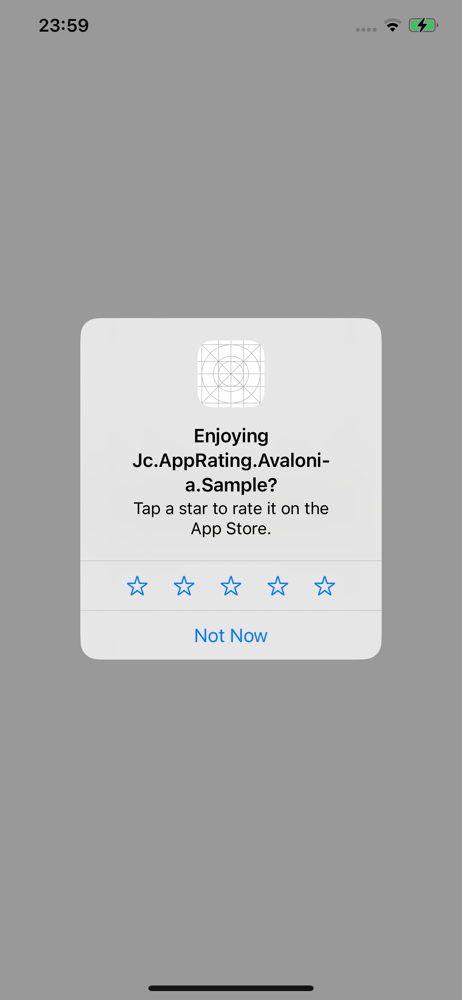

# Jc.AppRating.Avalonia

Library to bring App store app ratings to Avalonia mobile projects.

---

## Table of Contents

- [Introduction](#introduction)
- [Usage](#usage)
  - [Android](#android)
  - [iOS](#ios)

## Introduction

Jc.AppRating.Avalonia is a library to bring app store rating services to Avalonia Android and iOS projects.

This includes the in-app rating functionality for Android and iOS as well as the ability to open the app store page for the app to review.

## Usage

To use Jc.AppRating.Avalonia you must add the `Jc.AppRating.Avalonia` package to your cross-platform project.

```
dotnet add package Jc.AppRating.Avalonia
```

Followed by adding the Android/iOS `Jc.AppRating.Avalonia.xxx` package to the platform specific project(s).

```
dotnet add package Jc.AppRating.Avalonia.Android
dotnet add package Jc.AppRating.Avalonia.iOS
```

Then you must register AppRating in the `CustomizeAppBuilder` method in `MainActivity.cs` and `AppDelegate.cs` for Android and iOS respectively:

```c#
protected override AppBuilder CustomizeAppBuilder(AppBuilder builder)
{
    return base.CustomizeAppBuilder(builder)
        ...
        .UseAppRating();
}
```

Finally, you can access the methods like so:

```c#
// Subscribe to error events (when either method fails to execute)
AppRating.Current.OnError += (sender, error)
          => Console.WriteLine(error.Message);

// Open an in-app rating dialog
AppRating.Current.RequestInAppRatingAsync();
// Open the respective store app on the rating page
AppRating.Current.RequestInStoreRatingAsync("appId");
```

### iOS

In development, the review dialog will appear for you, but will not submit reviews.

> **Note**: The dialog will not appear when the app is downloaded via TestFlight.



### Android

In development, the review dialog will not appear for you... It can only be tested via an internal test track. You can see more information around that [here](https://developer.android.com/guide/playcore/in-app-review/test).

> **Note**: In production, the dialog will also not always show due to Google's crazy policies. It seems to be affected by a variety of factors, including quotas, whether you've had a recent review, and whether you've had a recent update, so who knows...
